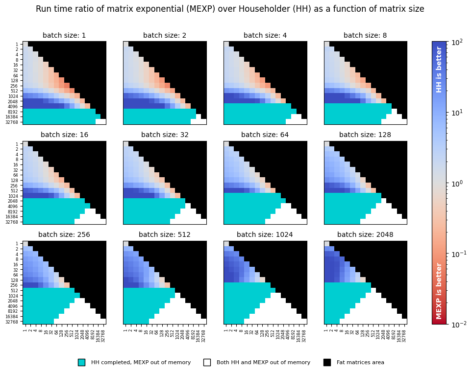
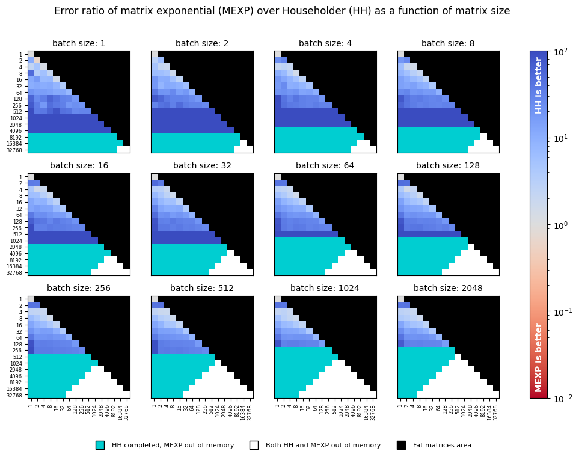

# Efficient Householder Transformation in PyTorch

[](https://pypi.org/project/torch-householder/)

[](https://pepy.tech/project/torch-householder)
[-BSD%203--Clause-blue.svg)](LICENSE_code)
[-CC%20BY%204.0-lightgrey.svg)](LICENSE_doc)


This repository implements the Householder transformation algorithm for calculating orthogonal matrices and orthonormal
frames. The algorithm is implemented as a Python package with differentiable bindings to PyTorch. In particular, the 
package provides an enhanced drop-in replacement for the `torch.orgqr` function. 

## Overview

APIs for orthogonal transformations have been around since LAPACK; however, their support in the deep learning 
frameworks is lacking. Recently, orthogonal constraints have become popular in deep learning as a way to regularize
models and improve training dynamics [[1](https://arxiv.org/abs/1909.09501), [2](https://arxiv.org/abs/1901.08428)], 
and hence the need to backpropagate through orthogonal transformations arised.

PyTorch 1.7 implements matrix exponential function `torch.matrix_exp`, which can be repurposed to performing the 
orthogonal transformation when the input matrix is skew-symmetric. This is the baseline we use in [Speed](#speed) and 
[Precision](#numerical-precision) evaluation.   

Compared to `torch.matrix_exp`, the Householder transformation implemented in this package has the following advantages: 
- Orders of magnitude lower memory footprint
- Ability to transform non-square matrices (orthonormal frames)
- A significant speed-up for non-square matrices
- Better numerical precision for all matrix and batch sizes

## Usage

#### Installation

```shell script
pip install torch-householder
```

#### API


The Householder transformation takes a matrix of Householder reflectors parameters of shape `d x r` with 
`d >= r > 0` (denoted as 'thin' matrix from now on) and produces an orthogonal matrix of the same shape.

`torch_householder_orgqr(param)` is the recommended API in the Deep Learning context. Other arguments of this function
are provided for compatibility with the `torch.orgqr` 
([Reference](https://pytorch.org/docs/stable/generated/torch.orgqr.html)) interface. 

Unlike `torch.orgqr`, `torch_householder_orgqr` supports:
- Both CPU and GPU devices
- Backpropagation through arguments
- Batched inputs

The parameter `param` is a matrix of size `d x r` or a batch of matrices `b x d x r` of Householder reflectors 
parameters. The LAPACK convention suggests to structure the matrix of parameters as shown in the figure on the right.

Given a matrix `param` of size `d x r`, here is a simple way to construct a valid matrix of Householder reflectors 
parameters from it:
```
hh = param.tril(diagonal=-1) + torch.eye(d, r)
``` 

This result can be used as an argument to `torch_householder_orgqr`.

#### Example

```python
import torch
from torch_householder import torch_householder_orgqr

D, R = 4, 2
param = torch.randn(D, R)
hh = param.tril(diagonal=-1) + torch.eye(D, R)

mat = torch_householder_orgqr(hh)

print(mat)              # a 4x2 orthonormal frame
print(mat.T.mm(mat))    # a 2x2 identity matrix
```

Output:
```
tensor([[ 0.4141, -0.3049],
        [ 0.2262,  0.5306],
        [-0.5587,  0.6074],
        [ 0.6821,  0.5066]])
tensor([[ 1.0000e+00, -2.9802e-08],
        [-2.9802e-08,  1.0000e+00]])
```

## Speed

Given a tuple of `b` (batch size), `d` (matrix height), and `r` (matrix width), we generate a random batch of orthogonal 
parameters of the given shape and perform a fixed number of orthogonal transformations with both `torch.matrix_exp` and 
`torch_householder_orgqr` functions. We then associate each such tuple with a ratio of run times taken by functions.

We perform a sweep of matrix dimensions `d` and `r`, starting with `1` and doubling each time until reaching `32768`. 
The batch dimension is swept similarly until reaching the maximum size of `2048`. The sweeps were performed 
on a single NVIDIA P-100 GPU with 16 GB of RAM using the code from the [benchmark](tests/benchmark.py): 



Since the `ORGQR` function's convention assumes only thin matrices with `d >= r > 0`, we skip the evaluation of fat 
matrices altogether.    

The `torch.matrix_exp` only deals with square matrices; hence to parameterize a thin matrix with `d > r`, we perform 
transformation of a square skew-symmetric matrix `d x d` and then take a `d x r` minor from the result. This aspect 
makes `torch.matrix_exp` especially inefficient for parameterizing orthonormal frames and provides major speed gains to the 
Householder transformation. 

## Numerical Precision

The numerical precision of an orthogonal transformation is evaluated using a synthetic [test](tests/benchmark.py#L50). 
Given a matrix size `d x r`, we generate random inputs and perform orthogonal transformation with the tested function. 
Since the output `M` of size `d x r` is expected to be a orthonormal frame, we calculate transformation error using the 
formula below. This calculation is repeated for each matrix size at least 5 times, and the results are averaged.

<p align="center">

</p>

We re-use the sweep used for benchmarking speed, compute errors of both functions using the formula above, and 
report their ratio in the following chart:

   

## Conclusions

The [speed](#speed) chart suggests that the Householder transformation is especially efficient when either matrix width 
`r` is smaller than matrix height `d` or when batch size is comparable with matrix dimensions. In these cases, the 
Householder transformation provides up to a few orders of magnitude speed-up. However, for the rest of the square matrix 
cases, `torch.matrix_exp` appears to be faster.

Another benefit of `torch_householder_orgqr` is its memory usage, which is much lower than that of 
`torch.matrix_exp`. This property allows us to transform either much larger matrices, or larger batches with 
`torch_householder_orgqr`. To give an example, in sub-figure corresponding to "batch size: 1", the largest matrix 
transformed with `torch_householder_orgqr` has the size `16384 x 16384`, whereas the largest matrix transformed with
`torch.matrix_exp` is only `4096 x 4096`.      

As can be seen from the [precision](#numerical-precision) chart, tests with the Householder transformation lead to 
orders of magnitude more accurate orthogonality constraints in all tested configurations. 

## Citation

To cite this repository, use the following BibTeX:

```
@misc{obukhov2021torchhouseholder,
    author = {Anton Obukhov},
    year = 2021,
    title = {Efficient Householder transformation in PyTorch},
    url = {https://github.com/toshas/torch-householder}
}
```
