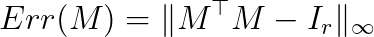
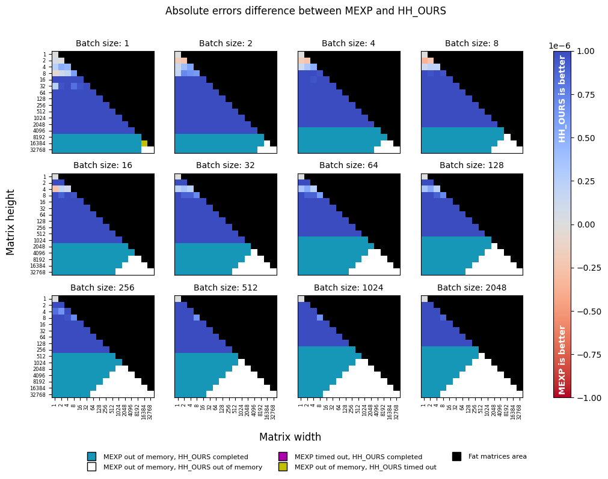

# Efficient Householder Transformation in PyTorch

[](https://pypi.org/project/torch-householder/)

[](https://pepy.tech/project/torch-householder)
[-BSD%203--Clause-blue.svg)](LICENSE_code)
[-CC%20BY%204.0-lightgrey.svg)](LICENSE_doc)
[](https://twitter.com/antonobukhov1)


This repository implements the Householder transformation algorithm for calculating orthogonal matrices and orthonormal
frames. The algorithm is implemented as a Python package with differentiable bindings to PyTorch. In particular, the 
package provides an enhanced drop-in replacement for the `torch.orgqr` function, which was renamed into 
`torch.linalg.householder_product` as of PyTorch 1.9.

## Overview

APIs for orthogonal transformations have been around since LAPACK; however, their support in the deep learning 
frameworks is lacking. Recently, orthogonal constraints have become popular in deep learning as a way to regularize
models and improve training dynamics [[1](https://arxiv.org/abs/1909.09501), [2](https://arxiv.org/abs/1901.08428), 
[3](https://arxiv.org/abs/2103.04217)], and hence the need to backpropagate through orthogonal transformations arised.

PyTorch 1.7 implements matrix exponential function `torch.matrix_exp`, which can be repurposed to performing the 
orthogonal transformation when the input matrix is skew-symmetric.   

PyTorch 1.9 renamed `torch.orgqr` into `torch.linalg.householder_product`, and added support of autograd, batching, and 
GPU execution.

Compared to orthogonal transformations built into PyTorch (`torch.matrix_exp`, `torch.linalg.householder_product`), 
torch-householder has the following advantages: 
- Orders of magnitude lower memory footprint
- Ability to transform non-square matrices (orthonormal frames)
- A significant speed-up
- Better numerical precision in almost all scenarios

## Usage

#### Installation

```shell script
pip3 install --upgrade pip
pip3 install torch-householder
```

#### API


The Householder transformation takes a matrix of Householder reflectors parameters of shape `d x r` with 
`d >= r > 0` (denoted as 'thin' matrix from now on) and produces an orthogonal matrix of the same shape.

`torch_householder_orgqr(param)` is the recommended API in the Deep Learning context. Other arguments of this function
are provided for compatibility with the new `torch.linalg.householder_product` 
([Reference](https://pytorch.org/docs/stable/generated/torch.linalg.householder_product.html#torch.linalg.householder_product)) 
and old `torch.orgqr` 
([Reference](https://pytorch.org/docs/stable/generated/torch.orgqr.html)) interfaces. 

The parameter `param` is a matrix of size `d x r` or a batch of matrices `b x d x r` of Householder reflectors 
parameters. The LAPACK convention suggests to structure the matrix of parameters as shown in the figure on the right.

Given a matrix `param` of size `d x r`, here is a simple way to construct a valid matrix of Householder reflectors 
parameters from it:
```
hh = param.tril(diagonal=-1) + torch.eye(d, r)
``` 

This result can be used as an argument to `torch_householder_orgqr`.

#### Example

```python
import torch
from torch_householder import torch_householder_orgqr

D, R = 4, 2
param = torch.randn(D, R)
hh = param.tril(diagonal=-1) + torch.eye(D, R)

mat = torch_householder_orgqr(hh)

print(mat)              # a 4x2 orthonormal frame
print(mat.T.mm(mat))    # a 2x2 identity matrix
```

Output:
```
tensor([[ 0.4141, -0.3049],
        [ 0.2262,  0.5306],
        [-0.5587,  0.6074],
        [ 0.6821,  0.5066]])
tensor([[ 1.0000e+00, -2.9802e-08],
        [-2.9802e-08,  1.0000e+00]])
```

## Benchmarks

Given a tuple of `b` (batch size), `d` (matrix height), and `r` (matrix width), we generate a random batch of orthogonal 
parameters of the given shape and perform a fixed number of orthogonal transformations with 
two methods. We then associate each such tuple with a ratio of run times taken by the functions.

We perform a sweep of matrix dimensions `d` and `r`, starting with `1` and doubling each time until reaching `32768`. 
The batch dimension is swept similarly until reaching the maximum size of `2048`. The sweeps were performed 
on a single NVIDIA P-100 GPU with 16 GB of RAM using the code from the [benchmark](tests/benchmark_all.py): 

Since the `ORGQR` function's convention assumes only thin matrices with `d >= r > 0`, we skip the evaluation of fat 
matrices altogether.    

The `torch.matrix_exp` only deals with square matrices; hence to transform a thin matrix with `d > r`, we perform 
transformation of a square skew-symmetric matrix `d x d` and then take a `d x r` minor from the result. This aspect 
makes `torch.matrix_exp` especially inefficient for transforming thin orthonormal frames and provides major speed gains 
to the Householder transformation. 

The numerical precision of an orthogonal transformation is evaluated using a synthetic test. 
Given a matrix size `d x r`, we generate random inputs and perform orthogonal transformation with the tested functions. 
Since the output `M` of size `d x r` is expected to be an orthonormal frame, we calculate transformation error using the 
formula below. This calculation is repeated for each matrix size several times, and the results are averaged.

<p align="center">

</p>

All experiments are conducted with float32 dtype, unless specified otherwise. We set a timeout of 10 min for each 
experiment, which leaves roughly 5 min for each transformation (including one mandatory warm-up iteration). Those 
interested in revealing true values in magenta and yellow areas in the plots below can increase the timeout and re-run 
the corresponding experiments.

### Benchmarking `torch.matrix_exp` against torch-householder

With a few exceptions of square matrices, torch-householder (HH_OURS) is tens of times faster than `torch.matrix_exp` 
(MEXP), and becomes especially efficient with large batch sizes.


In the numerical precision, torch-householder dominates `torch.matrix_exp` in all configurations.

   

### Benchmarking `torch.linalg.householder_product` against torch-householder

Despite the highly-efficient CUDA-accelerated backends behind `torch.linalg.householder_product` (HH_PT), it is slower
than torch-householder (HH_OURS) in all configurations (up to ten times and more). torch-householder is also more 
memory-efficient, as it permits processing larger workloads without being killed with "out of memory" reason.


torch-householder is slightly less precise than `torch.linalg.householder_product`, with absolute error difference 
close to machine precision for `float32` data type (1e-7). 

   

### Benchmarking `torch.linalg.householder_product` (float32) against torch-householder (float64)

In addition to the previous experiment, we consider the same setting, but with torch-householder operating on the 
`dtype=torch.float64` inputs (HH_OURS_64). As can be seen from the plots below, speed-wise torch-householder is still 
an order of magnitude faster, while its precision now dominates that of `torch.linalg.householder_product`. In terms of 
memory, it is still more efficient than `torch.linalg.householder_product`, despite doubling the memory requirements due 
to switching float32 to float64.


Similar to float32 case above, the following precision plot reveals a peculiar drop in precision when the smaller 
dimension is less or equal than 16, which may correspond to different code paths, or different backends used in the 
`torch.linalg.householder_product` function.


## Conclusion

torch-householder is faster, more precise, and uses less memory than any other solution for orthogonal 
transformations, bundled in PyTorch (true at least for PyTorch 1.9 and NVIDIA P100 16Gb GPU).

Thus, torch-householder allows transforming either much larger matrices, or larger batches. To give an example, 
in sub-figures corresponding to "Batch size: 1", the largest matrix transformed with torch-householder has the size 
`16384 x 16384` (despite the timeout), whereas the largest matrix transformed with `torch.matrix_exp` is only 
`4096 x 4096`, and the largest matrix transformed with `torch.linalg.householder_product` is `16384 x 8192` 
(despite the timeout).      

## Citation

To cite this repository, use the following BibTeX:

```
@misc{obukhov2021torchhouseholder,
  author={Anton Obukhov},
  year=2021,
  title={Efficient Householder Transformation in PyTorch},
  url={www.github.com/toshas/torch-householder}
}
```
